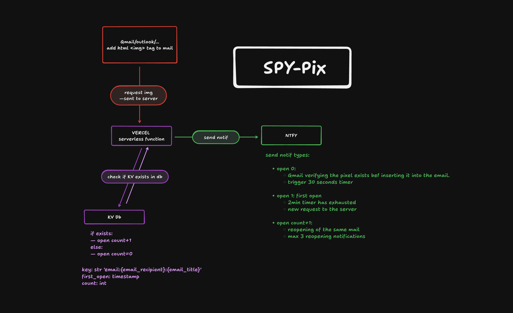

# Vercel KV Setup Instructions



Inspired by [collinsmc23/spy-pixel](https://github.com/collinsmc23/spy-pixel)

## Step 0: Initialize vercel project setup
Install vercel CLI:
```
npm i -g vercel
vercel login
```
Create node project:
```
mkdir spy-pix
cd spy-pix
npm init -y
```
Clone project

Deploy to vercel:
```
vercel
```

## Step 1: Create a Vercel KV Database

1. Go to your Vercel dashboard: https://vercel.com/dashboard
2. Select your project (or create a new one)
3. Go to the "Storage" tab
4. Click "Create Database"
5. Select "KV" (Key-Value Store)
6. Give it a name (e.g., "spy-pixel-kv")
7. Click "Create"

## Step 2: Connect KV to Your Project

1. After creating the database, click "Connect to Project"
2. Select your spy-pixel project
3. Vercel will automatically add the required environment variable:
   - `REDIS_URL` - Connection string for your Redis database

## Step 3: Deploy Your Function

Deploy your project to Vercel:

```bash
vercel deploy
```

## Step 4: Test Your Tracking Pixel

After deployment, your tracking pixel URL will be:

```
https://your-project.vercel.app/api/handler?recipient=user@example.com&title=Newsletter
```

Embed this in an email as an image tag:

```html

```

## How It Works

### First Load (Tracker Activation)
- When the pixel is first loaded, a "Tracker Activated" notification is sent immediately via ntfy.sh
- An activation delay of 30 seconds is set (configurable via `ACTIVATION_DELAY_MINUTES`) to avoid getting spammed while setting up the pixel inside the email.
- The request is stored inside Vercel KV with a counter initialized to 0 and an activation timestamp used to check if the 30seconds delay are past

### During Activation Delay (0-30 seconds)
- Any opens during this period are logged but ignored
- This prevents counting automated email client previews or pre-fetching by email provider (Gmail, Outlook, ...) which check the image actually exists before loading it to the email
- You'll see logs showing time remaining until activation

### After Activation (30+ seconds)
- First request after activation delay is considered the first email opening → "First Open" notification (count=1)
- Subsequent opens → "Reopened" notifications (count=2, 3, etc.)
- After 3+ opens, notifications stop to prevent spam on ntfy.sh

### Data Storage
- Each email is tracked by a unique key: `email:{recipient}:{title}`
- Stored data includes:
  - `first_open`: Timestamp of initial pixel load
  - `count`: Number of opens after activation
  - `activation_time`: When the tracker becomes active (30s after first load)
- You'll receive notifications via ntfy.sh when emails are opened

### Notification Types
1. **Tracker Activated** (sparkle ❇️) - Pixel first embedded/loaded in email
2. **First Open** (folder 📂) - First legitimate open after 30s delay
3. **Reopened** (arrows 🔄) - Subsequent opens (up to 3 total)
